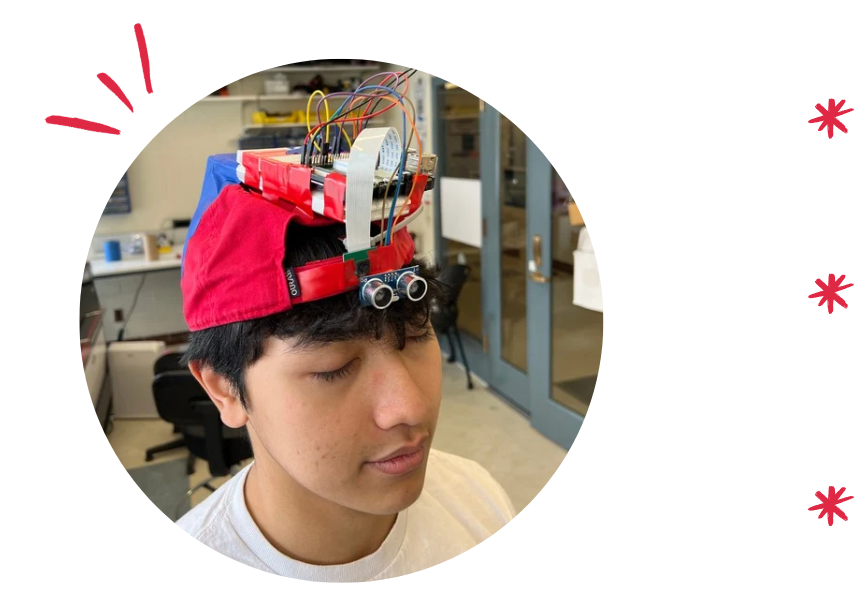

# Seeround  
**A Wearable Assistive Device for Indoor Navigation**  
*Built with Python, OpenCV, PySound, and Raspberry Pi*

---
## 📖 Overview  
**Seeround** is an award winning wearable device designed to help visually impaired users navigate **indoor spaces hands free**.  
The system combines **real-time object recognition** with **spatial audio feedback**, allowing users to gain situational awareness without relying on physical assistance.  

🏆 **Best Hardware Hack** at **Cornell Makeathon** (Feb 2025).  

---

## Tech Stack  
- **Programming Languages:** Python  
- **Libraries & Tools:** OpenCV, PySound 
- **Hardware:** Raspberry Pi, Ultrasonic Distance Sensor

---

## How It Works  
1. **Capture Environment** – Camera feed from the wearable device streams to the Raspberry Pi.  
2. **Detect & Identify Objects** – OpenCV analyzes the video stream to recognize and track nearby people.
3. **Calculate Position** – Object location and distance are determined.  
4. **Provide Audio Cues** – PySound generates directional audio feedback to guide the user.  

---

## Demo
 - [Watch the Live Demo on YouTube](https://youtu.be/4V7Y8gmsLtg)

